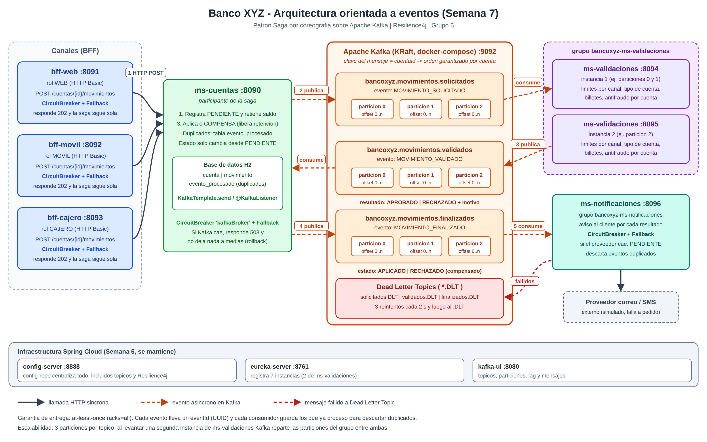

# Banco XYZ — Tolerancia a fallos y arquitectura de eventos con Kafka

**Desarrollo Backend III (PBY2203) — Experiencia 3, Semana 7**
**Grupo 6:** Joaquín Gómez Flores — Luis Rebolledo Corvalán

## 1. De qué se trata

Seguimos con el proyecto de Banco XYZ. Hasta la semana 6 el sistema solo **consultaba**
información: los tres BFF le pedían datos a `ms-cuentas` de forma síncrona, con Config Server,
Eureka, Circuit Breaker y Spring Security.

Esta semana agregamos la primera operación que **escribe**: un cliente pide un **depósito o un
retiro** desde cualquiera de los tres canales. La transacción se procesa como una **saga
orientada a eventos sobre Apache Kafka**, con dos microservicios nuevos (`ms-validaciones` y
`ms-notificaciones`) y con Resilience4j donde un servicio depende de otro.

## 2. Arquitectura elegida (criterio 1)

### Patrón: Saga por coreografía

Un retiro toca tres responsabilidades que viven en servicios distintos: el saldo
(ms-cuentas), las reglas y el antifraude (ms-validaciones) y el aviso al cliente
(ms-notificaciones). No existe una sola transacción de base de datos que abarque a los tres,
así que usamos el **patrón Saga**. Cada paso es una transacción local y, si un paso posterior
rechaza la operación, se ejecuta un **paso compensatorio**.

| Alternativa | Decisión |
| --- | --- |
| **Saga por coreografía** (elegida) | Son solo 3 participantes con un flujo lineal. Cada servicio reacciona a un evento y publica el siguiente, sin un orquestador central. La guía recomienda Kafka para la coreografía. |
| Saga por orquestación | Agregaría un servicio orquestador que, con tan pocos pasos, no aporta más control. |
| Event Sourcing | Obligaría a reescribir `ms-cuentas`, que guarda estado con los datos migrados del legacy. Nuestro caso necesita coordinar servicios, no reconstruir el historial del saldo. |

### Tecnología: Apache Kafka (no JMS)

- Varios servicios necesitan reaccionar a los mismos eventos, cada uno con su propio **grupo de
  consumidores**.
- Las **particiones** permiten tener más de una instancia de `ms-validaciones` trabajando en
  paralelo (escalabilidad).
- Los mensajes **quedan guardados** en el tópico por un tiempo configurado. Si un servicio estuvo
  caído, al volver lee lo que se perdió.

### Pasos de la saga

| Paso | Servicio | Qué hace | Evento que publica |
| --- | --- | --- | --- |
| 1 | ms-cuentas | Registra el movimiento `PENDIENTE`. Si es retiro, **retiene** el monto del saldo | `MOVIMIENTO_SOLICITADO` |
| 2 | ms-validaciones | Revisa el límite por canal, el tipo de cuenta, el múltiplo de billetes y el antifraude | `MOVIMIENTO_VALIDADO` (APROBADO / RECHAZADO + motivo) |
| 3 | ms-cuentas | Si fue aprobado, aplica el movimiento. Si fue rechazado, **compensa** devolviendo lo retenido | `MOVIMIENTO_FINALIZADO` |
| 4 | ms-notificaciones | Avisa al cliente por correo o SMS (proveedor simulado) | — |

## 3. Diagrama (criterio 2)



### Tópicos y eventos

| Tópico (3 particiones) | Evento | Productor | Consumidor (grupo) |
| --- | --- | --- | --- |
| `bancoxyz.movimientos.solicitados` | `MOVIMIENTO_SOLICITADO` | ms-cuentas | ms-validaciones (`bancoxyz-ms-validaciones`) |
| `bancoxyz.movimientos.validados` | `MOVIMIENTO_VALIDADO` | ms-validaciones | ms-cuentas (`bancoxyz-ms-cuentas`) |
| `bancoxyz.movimientos.finalizados` | `MOVIMIENTO_FINALIZADO` | ms-cuentas | ms-notificaciones (`bancoxyz-ms-notificaciones`) |
| `<tópico>.DLT` | el mensaje que falló 3 veces | el consumidor que falló | — (se revisa en Kafka UI) |

Todos los eventos llevan un `eventId` (UUID), `tipoEvento`, `fechaEvento` y `solicitudId`, y la
clave del mensaje es el `cuentaId`. Ejemplo de `MOVIMIENTO_VALIDADO`:

```json
{
  "eventId": "8f0d6c1e-5a52-4a53-9d4c-3a0a8c5d2b11",
  "tipoEvento": "MOVIMIENTO_VALIDADO",
  "fechaEvento": "2026-09-28T14:03:11.402Z",
  "solicitudId": "c2a9d6e4-7a0b-4c55-bb2f-55e1a8d7f001",
  "movimientoId": 953,
  "cuentaId": 101,
  "tipoMovimiento": "RETIRO",
  "monto": 1000,
  "canal": "CAJERO",
  "resultado": "RECHAZADO",
  "motivo": "TIPO_CUENTA_NO_PERMITE_RETIRO: las cuentas de tipo PRESTAMO no permiten retiros",
  "validadoPor": "bancoxyz-ms-validaciones:8094"
}
```

## 4. Tolerancia a fallos con Resilience4j (criterio 3)

Usamos el mismo mecanismo de la semana 6, **Circuit Breaker con Fallback**, ahora en los puntos
nuevos donde un servicio depende de otro:

| Dónde | Si falla... | Circuit Breaker | Qué hace el Fallback |
| --- | --- | --- | --- |
| 3 BFF, `POST .../movimientos` | ms-cuentas | `msCuentas` | Responde `503` con estado `NO_REGISTRADA` y un mensaje claro |
| ms-cuentas, al publicar en Kafka | Kafka | `kafkaBroker` | Responde `503` y **deshace** la transacción (rollback), así no queda saldo retenido sin evento |
| ms-notificaciones, al avisar al cliente | el proveedor de correo/SMS | `proveedorNotificaciones` | La notificación queda `PENDIENTE` y el consumidor sigue con los demás mensajes |
| 3 BFF, consultas (semana 6) | ms-cuentas | `msCuentas` | Respuesta degradada por canal |
| ms-cuentas (semana 6) | exceso de solicitudes | RateLimiter | 429 |

En los consumidores Kafka aplicamos **reintentos controlados**: 3 reintentos cada 2 segundos. Si
el mensaje sigue fallando, se mueve a `<tópico>.DLT` para no bloquear la partición.

## 5. Mensajería asíncrona (criterio 4)

- Publicación con `KafkaTemplate.send(...)` y consumo con `@KafkaListener`, igual que en el
  ejemplo de la semana (`kafka-batch-sample`).
- **Garantía de entrega: at-least-once** (`acks=all`). Un mensaje no se pierde, pero puede
  llegar más de una vez.
- **Manejo de duplicados**, como indica la guía: cada evento tiene un **identificador único
  (UUID)** y cada consumidor **guarda los eventos que ya procesó**. ms-cuentas los guarda en la
  tabla `evento_procesado`; ms-validaciones y ms-notificaciones, en memoria. Si llega uno
  repetido, se descarta.
- **Escalabilidad:** cada tópico tiene 3 particiones. Al levantar una segunda instancia de
  `ms-validaciones` (puerto 8095) en el mismo grupo, Kafka reparte las particiones entre ambas.
  Si una se cae, la otra toma todas las particiones.

## 6. Dónde se cumple cada criterio de la pauta

| Criterio | Dónde mirarlo |
| --- | --- |
| Define la arquitectura de eventos alineada al patrón | Sección 2; `ms-cuentas/services/MovimientoService.java` y `SagaMovimientoService.java` |
| Diagrama con tópicos, mensajes y eventos | `docs/Figura_01_diagrama.png` y sección 3 |
| Tolerancia a fallos con Resilience4j | `config-repo/*.properties`, `bff-*/services/SolicitudMovimiento*Service.java`, `ms-cuentas/messaging/EventoPublisher.java`, `ms-notificaciones/clients/ProveedorNotificacionesClient.java` |
| Mensajería Kafka funcional y escalable | `*/messaging/`, `*/config/KafkaConsumidorConfig.java`, `docker-compose.yml` |

## 7. Estructura

```
Exp3_S7_Grupo6/
├── docker-compose.yml   Kafka + Kafka UI
├── config-server/       Config Server                              (8888)
├── eureka-server/       Service Discovery                          (8761)
├── config-repo/         Configuración centralizada
├── ms-cuentas/          Cuentas, movimientos y saga                (8090)
├── ms-validaciones/     Reglas de negocio y antifraude — NUEVO     (8094 y 8095)
├── ms-notificaciones/   Avisos al cliente — NUEVO                  (8096)
├── bff-web/             BFF canal Web                              (8091)
├── bff-movil/           BFF canal Móvil                            (8092)
├── bff-cajero/          BFF canal Cajero                           (8093)
├── docs/                Diagrama de arquitectura y fotos 
```

## 8. Requisitos

- Java 17 y Maven 3.9 o superior
- Docker Desktop (para Kafka)
- Spring Boot 3.3.5, Spring Cloud 2023.0.3 y Spring for Apache Kafka

## 9. Cómo ejecutarlo

```
0) docker compose up -d        (Kafka en 9092, Kafka UI en http://localhost:8080)
1) cd config-server     && mvn spring-boot:run
2) cd eureka-server     && mvn spring-boot:run
3) cd ms-cuentas        && mvn spring-boot:run
4) cd ms-validaciones   && mvn spring-boot:run
5) cd ms-validaciones   && mvn spring-boot:run "-Dspring-boot.run.arguments=--PUERTO=8095"
6) cd ms-notificaciones && mvn spring-boot:run
7) cd bff-web           && mvn spring-boot:run
8) cd bff-movil         && mvn spring-boot:run
9) cd bff-cajero        && mvn spring-boot:run
```

## 10. Endpoints nuevos

| Servicio | Método y ruta | Qué hace |
| --- | --- | --- |
| bff-web / bff-movil / bff-cajero | `POST /bff/{canal}/cuentas/{id}/movimientos` | Pide un depósito o retiro. Responde 202 `PENDIENTE` |
| bff-web / bff-movil / bff-cajero | `GET /bff/{canal}/movimientos/solicitudes/{solicitudId}` | Estado de la solicitud, adaptado al canal |
| ms-cuentas | `POST /core/movimientos` | Inicio de la saga (lo llaman los BFF) |
| ms-cuentas | `GET /core/movimientos/solicitudes/{solicitudId}` | Estado de una solicitud |
| ms-cuentas | `GET /core/cuentas/{id}/solicitudes` | Historial de solicitudes de la cuenta |
| ms-validaciones | `GET /validaciones/estadisticas` | Instancia, particiones atendidas y contadores |
| ms-notificaciones | `GET /notificaciones` | Notificaciones enviadas y pendientes |
| ms-notificaciones | `POST /notificaciones/proveedor/falla?activa=true` | Simula la caída del proveedor de correo/SMS |

Cuerpo del POST en los BFF:

```json
{ "tipoMovimiento": "RETIRO", "monto": 2000, "descripcion": "opcional" }
```

## 11. Usuarios

| Servicio | Usuario | Clave | Rol |
| --- | --- | --- | --- |
| bff-web / bff-movil / bff-cajero | `canal-web` / `canal-movil` / `canal-cajero` | `Web-2026` / `Movil-2026` / `Cajero-2026` | WEB / MOVIL / CAJERO |
| ms-cuentas | `svc-cuentas` | `Cuentas-2026` | SERVICE |
| ms-validaciones | `svc-validaciones` | `Validaciones-2026` | SERVICE |
| ms-notificaciones | `svc-notificaciones` | `Notificaciones-2026` | SERVICE |

## 12. Qué cambió respecto a la semana 6

| Tema | Semana 6 | Semana 7 |
| --- | --- | --- |
| Operaciones | Solo consultas | Depósitos y retiros como saga asíncrona |
| Comunicación | Solo HTTP | HTTP para pedir y Kafka para procesar |
| Microservicios | 4 + Config + Eureka | 6 (+ ms-validaciones y ms-notificaciones) + Config + Eureka + Kafka |
| Circuit Breaker | BFF → ms-cuentas (consultas) | Además en las escrituras, ms-cuentas → Kafka y ms-notificaciones → proveedor |
| Movimientos que se consultan | Todos | Solo los `APLICADO` (los pendientes y rechazados se ven en `/solicitudes`) |
